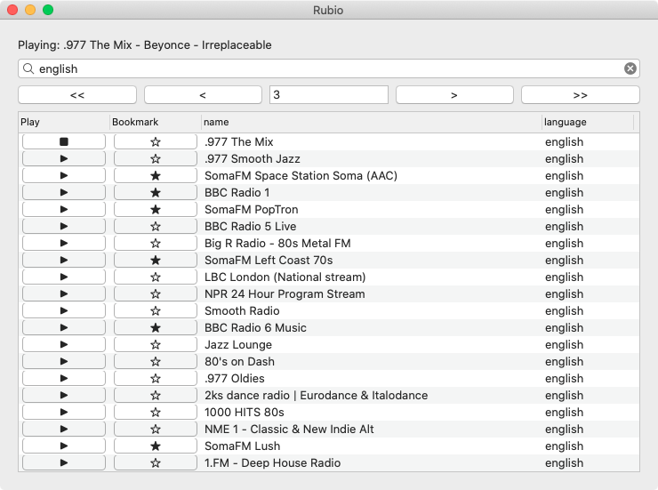

# rubio-radio
[](https://badge.fury.io/rb/rubio-radio)

Linux


Mac



Windows


:bowtie: Alpha

## Installation

### Requirements:

**[VLC](https://github.com/videolan/vlc)**

`rubio` uses the `vlc -I rc` as the audio playback backend.

On Mac, it is recommended that you install VLC via [Homebrew](https://brew.sh/) to ensure the `vlc` command is added to the PATH environment variable automatically:

```
brew install vlc
```

On Windows, install VLC using the [Windows installer](https://www.videolan.org/vlc/download-windows.html), and then add the installed VLC app directory to the PATH environment variable (e.g. `C:\Program Files (x86)\VideoLAN\VLC`) to make the `vlc` command available.

### Ruby Gem:

```
gem install rubio-radio
```

## Usage

Run with this command:

```
rubio
```

All [Radio Browser](https://www.radio-browser.info/) stations are displayed by default. But, you can customize the count with `--count COUNT` (note that currently, there are only about 33,000 [Radio Browser](https://www.radio-browser.info/) stations total). Setting the count to `-1` will fetch all stations.

```
rubio --count 20000
```

The stations are fetched gradually (asynchronously) from the [Radio Browser](https://www.radio-browser.info/) web API to have the app start instantly (avoid having the user wait for the app to start) no matter what the total count of stations is. But, you can avoid gradual prefetching if you prefer.

```
rubio --no-gradual
```

Default player is `vlc -I rc`. But, you can use any command line player that can take URL of radio station as its first argument.

```
rubio --backend mpg123
```

Learn more about `rubio` options:

```
rubio --help
```

```
Usage: rubio [options]
        --vlc [STR]         use VLC interface STR on the backend [dummy]
        --mpg123            use mpg123 on the backend
    -b, --backend STR       command to use as backend player ['vlc -I rc']
    -c, --count INT         number of stations to fetch from radio-browser or -1 to fetch them all [-1]
        --per-page INT      number of stations per page [20]
    -w, --width INT         main window width
    -h, --height INT        main window height
        --[no-]page-count   show/hide page count [false]
        --[no-]menu         show/hide menu [true]
        --[no-]bookmarks    show/hide bookmarks [true]
        --[no-]gradual      gradually/non-gradually fetch stations [true]
        --[no-]margins      show/hide margins [true]
        --debug             output status of monitored threads
        --help              show this help message
        --version           show the rubio version number
```

Examples:

```
rubio --vlc              # vlc -I rc (interactive command line interface)
rubio --mpg123           # rubio --backend mpg123
rubio --count 1000       # Displays the top 1,000 Radio Browser stations
```

Minimalistic Example:

```
rubio --per-page 6 --no-margins --no-menu --no-bookmarks
```


Page Count Example:

```
rubio --page-count
```


### Filtering

The filter field does AND-based filtering when you enter multiple words separated by spaces:

```
jazz smooth
```

Also, the filter field supports exact term filtering if you enter multiple words surrounded by double-quotes.

```
"bossa nova"
```

Last but not least, the filter field supports column-specific queries by including a full column name or the first few letters, followed by colon (:), followed by a single word or double-quoted multiple words for exact term matching against the column:

```
name:talk language:eng
```

or just:

```
n:talk l:eng
```


This advanced example matches the word `FM` against the name column, and language `bahasa indonesia` against the language column.

```
n:FM l:"bahasa indonesia"
```

Finally, you can mix different types of filters:

```
brasil "bossa jazz" l:brazilian l:portuguese
```

### Menus

You can use the top menu bar to stop the currently playing radio station, bookmark, unbookmark, view only bookmarked stations, view only currently playing station, and read the about dialog.


Bookmarks are stored in `~/.rubio-radio/bookmarks.yml`

## Links

* [Ruby](https://github.com/ruby/ruby)
  * spawn
* [Radio Browser](https://www.radio-browser.info/)
  * [Radio Browser API](https://de1.api.radio-browser.info/)
* [Glimmer DSL for LibUI](https://github.com/AndyObtiva/glimmer-dsl-libui)

## Change Log

[CHANGELOG.md](CHANGELOG.md)

## LICENSE

[MIT](LICENSE.txt)
